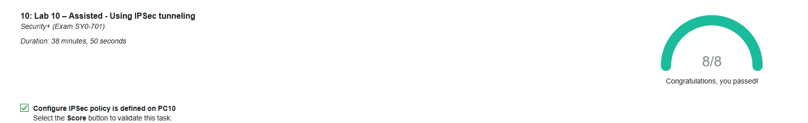

### Using IPSec Tunneling

In this lab I set up IPSec tunneling between two Windows systems to secure traffic on the network. I configured IPSec policies on PC10 and PC20, verified that the rules were active, and tested communication between the systems. I also reviewed why certain ICMP traffic did not appear in the capture and confirmed that the secure connection was working as expected.

