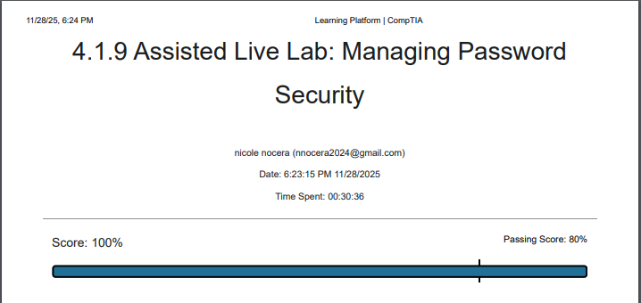

# Managing Password Security Lab

This lab focused on enforcing strong password policies, understanding account security, and managing credential best practices.

### Key Takeaways
- Learned how password complexity affects overall system security
- Practiced managing secure credentials and password expiration
- Applied security controls related to authentication and access

### Screenshot

