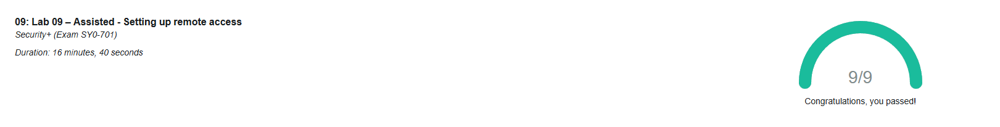

### Assisted Lab: Setting Up Remote Access

In this lab I learned how to set up and use remote access tools on Windows and Linux. I practiced using Remote Desktop between Windows systems, installed and configured SSH on a Linux machine, and connected to it from Windows with both the terminal and the GUI. This helped me understand how remote access works in real environments and why it matters for secure administration.

