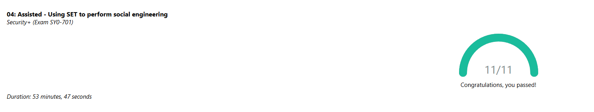

### Using SET to Perform Social Engineering

In this lab I used the Social Engineering Toolkit to walk through a realistic social engineering attack in a controlled environment. I learned how SET creates payloads, how an attacker would deliver them, and how the system responds when the target interacts with the attack. This gave me a better understanding of how social engineering works and why user awareness and strong security controls matter.

