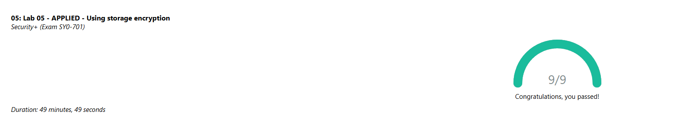

# Using Storage Encryption

In this lab I practiced securing data by encrypting storage devices. I worked with encryption settings, managed keys, and saw how encryption protects files even if a device is lost or accessed without permission. It helped me understand how encryption supports confidentiality and keeps sensitive information safe.

## Screenshot

