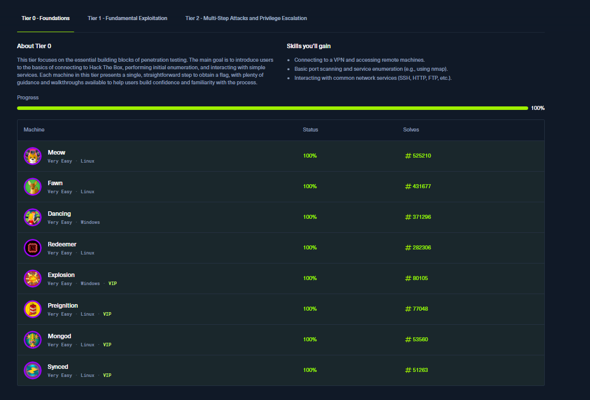

# Hack The Box Tier 0

## Profile

This is my Hack The Box profile, which tracks my progress, completed machines, and overall activity on the platform.

## Overview

This folder contains the machines I completed in the Tier 0 Foundations track on Hack The Box. These labs focus on basic enumeration, interacting with remote machines, and understanding simple misconfigurations. I used these machines to build confidence working with Linux, Windows, basic network services, and VPN-based lab environments.

## Completed Machines

- Meow  
- Fawn  
- Dancing  
- Redeemer  
- Explosion  
- Preignition  
- Mongod  
- Synced  

All machines were completed at 100 percent.

## Screenshot

This screenshot shows my completion of all Tier 0 machines.

## What I Learned

- How to connect to lab machines using the HTB VPN  
- Basic enumeration with tools like nmap  
- How to interact with services such as SSH, FTP, and SMB  
- How to look for simple weaknesses or misconfigurations  
- How to navigate Linux and Windows file systems to locate flags
