# Active Directory Home Lab

## Overview

This project documents the process of building a Windows Server 2025 Active Directory environment from scratch using Oracle VirtualBox.

The goal of this lab was to gain experience with common Windows Server administration tasks like Active Directory deployment, DNS configuration, OUs, user management, security groups, Group Policy, and common help desk tasks.

Instead of stopping after the initial installation, I built a small business environment to practice realistic administrative tasks such as onboarding users, organizing departments, managing security groups, applying Group Policy, and disabling employee accounts.

---

## Note

This project is part of my ongoing IT and cybersecurity learning journey. Along with building technical skills, I'm also learning how to properly document projects and organize my GitHub portfolio.

At the bottom of this README I've included some of the Microsoft documentation, tutorials, and GitHub resources I used while building both this Active Directory lab and improving the presentation of my repositories. My goal is to continually improve both my technical skills and the way I document my work.

---

# Environment

| Component | Details |
|-----------|---------|
| Hypervisor | Oracle VirtualBox |
| Operating System | Windows Server 2025 Evaluation |
| Server Name | DC01 |
| Domain | homelab.local |
| Active Directory | Active Directory Domain Services (AD DS) |
| DNS | Installed with Active Directory |

---

# Skills Demonstrated

- Windows Server Administration
- Active Directory Domain Services (AD DS)
- DNS Configuration
- Static IP Configuration
- Domain Controller Deployment
- Organizational Units (OUs)
- User Account Management
- Security Group Administration
- Group Policy Management
- User Onboarding
- User Offboarding
- Basic Help Desk Administration

---

# Project Walkthrough

## 1. Configure the Server

- Installed Windows Server 2025
- Renamed the server to DC01
- Configured a static IP address
- Verified network connectivity using `ipconfig` and `ping`

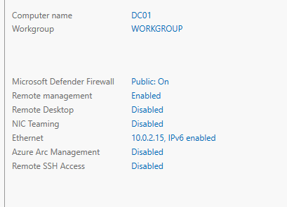

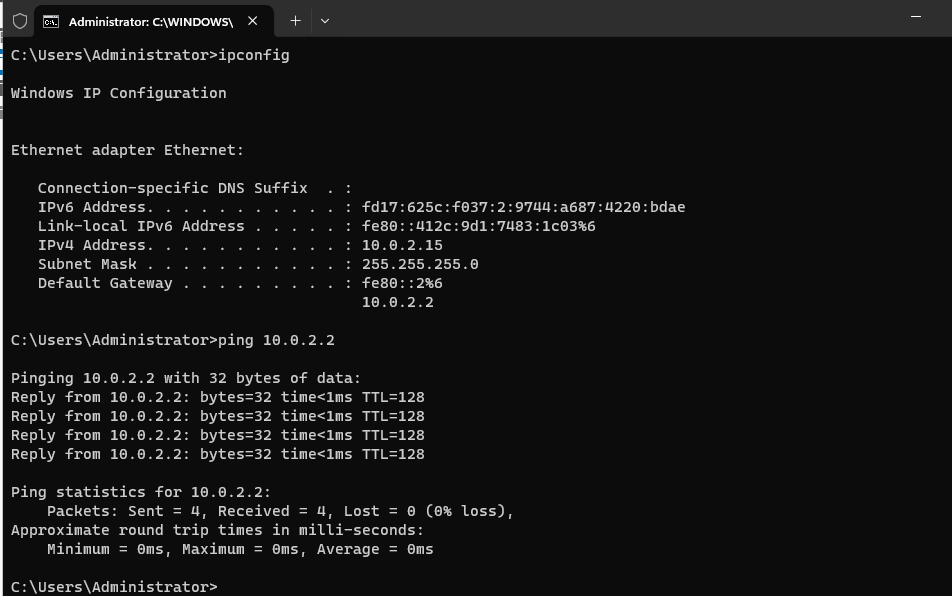

---

## 2. Install Active Directory Domain Services

Installed the Active Directory Domain Services role using Server Manager.

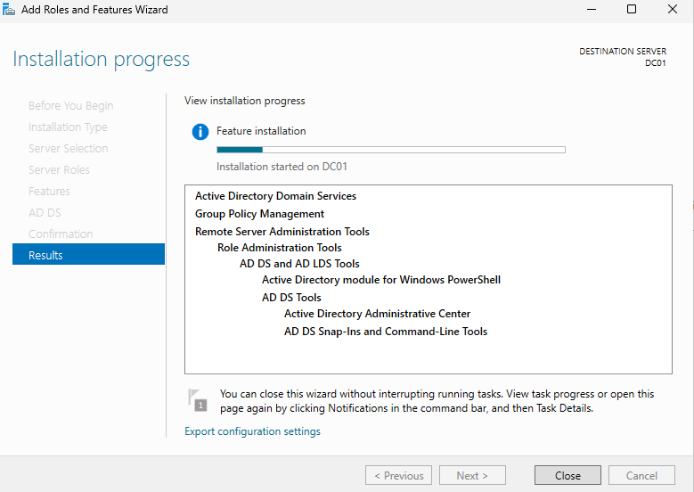

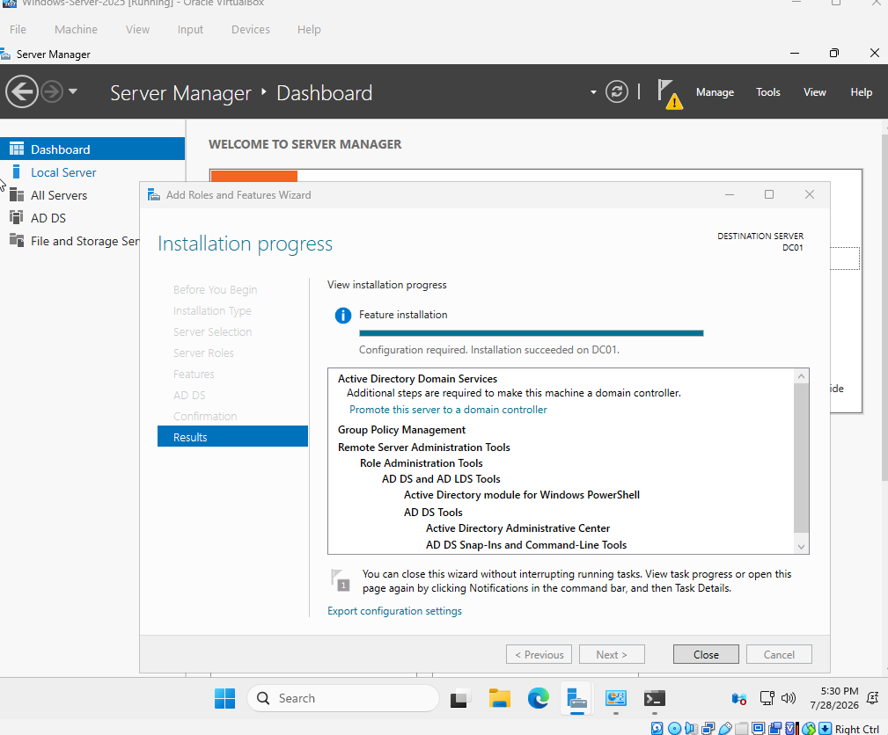

---

## 3. Promote the Server to a Domain Controller

Created a new Active Directory forest using the domain:

**homelab.local**

During installation I received the expected DNS delegation warning because this was a brand-new forest with no existing DNS infrastructure.

All prerequisite checks completed successfully before promoting the server.

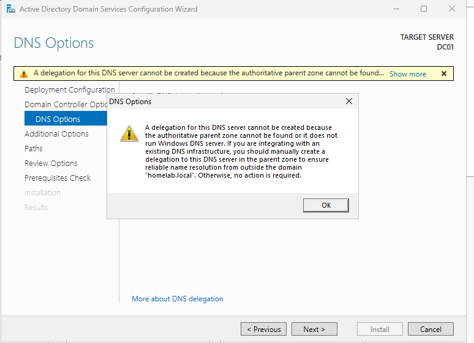

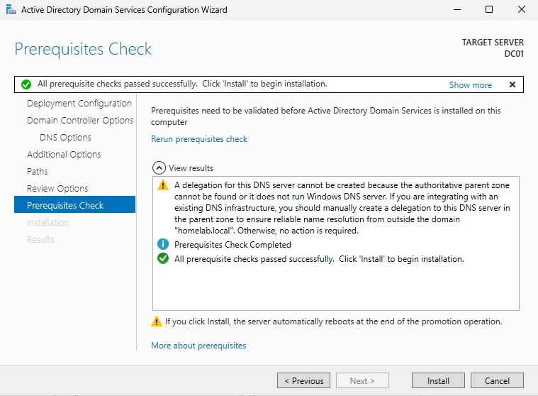

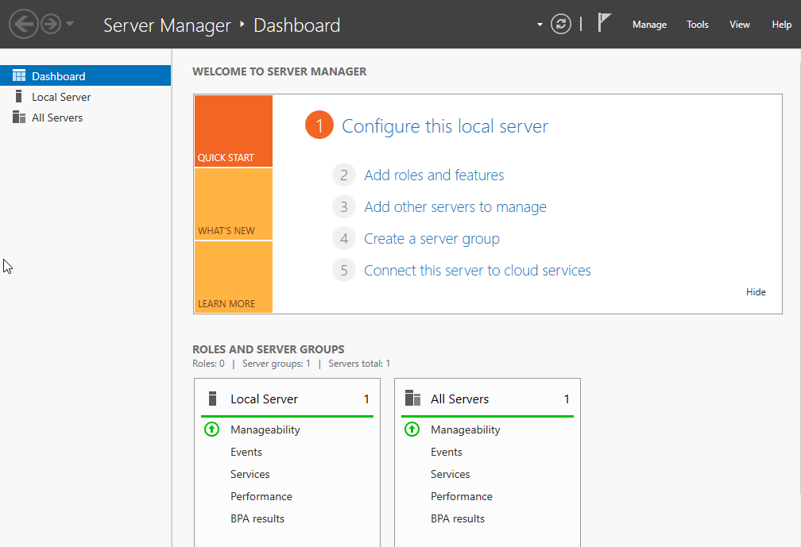

---

## 4. Create Organizational Units

Created Organizational Units to organize users and resources into separate departments.

Organizational Units created:

- Company Users
- HR
- IT
- Servers
- Workstations
- Security Groups
- Disabled Users

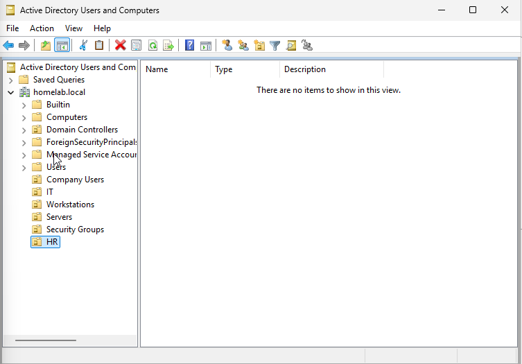

---

## 5. Create User Accounts

Created user accounts to simulate a small business environment.

Departments include:

- Company Users
- IT
- HR

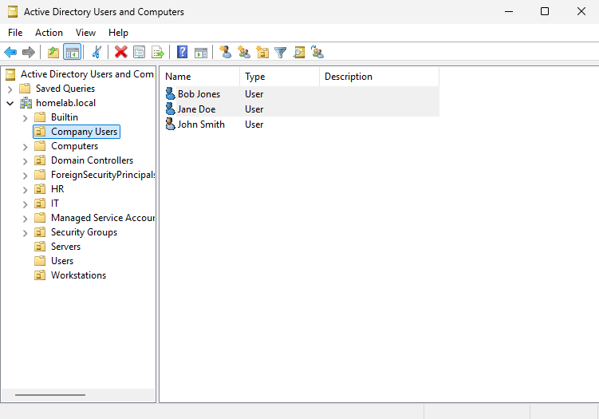

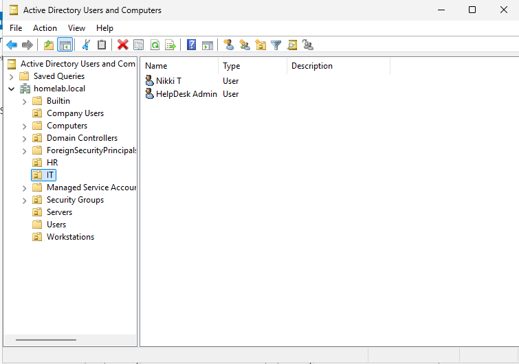

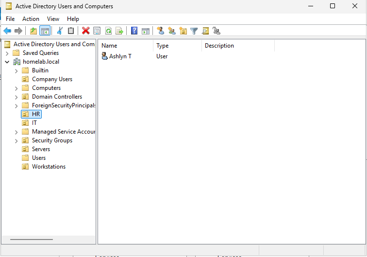

---

## 6. Create Security Groups

Created security groups to simplify permission management and make user administration easier.

Groups created:

- Company Employees
- HR Staff
- IT Support
- Domain Admins (Labs)

Added users to the appropriate security groups.

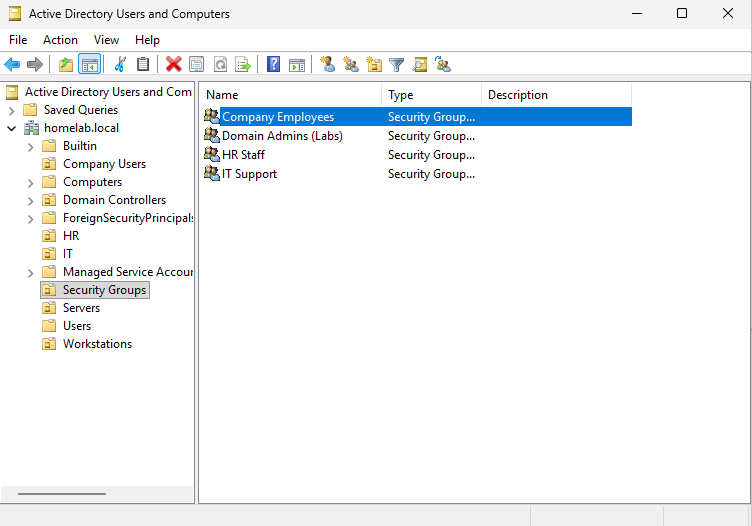

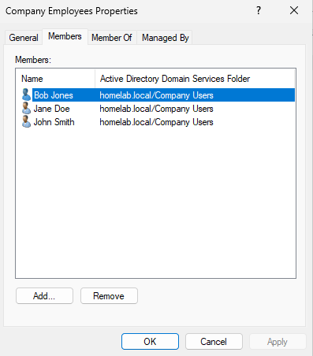

---

## 7. Perform Active Directory Administration

Practiced several common Active Directory administration tasks.

### Disabled a User Account

Disabled a user account to simulate an employee leaving the company.

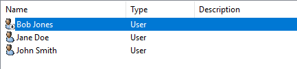

---

### Department Transfer

Moved a user from the Company Users OU into the HR department and updated group membership.

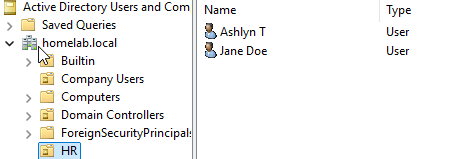

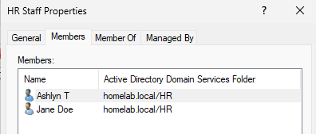

---

## 8. Configure Group Policy

Created a Group Policy Object named **Company Desktop Policy**.

Linked the policy to the Company Users Organizational Unit and configured it to prevent users from accessing Control Panel and Windows Settings.

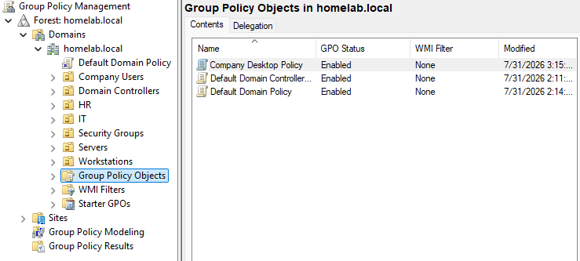

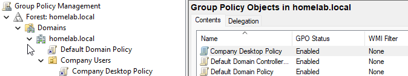

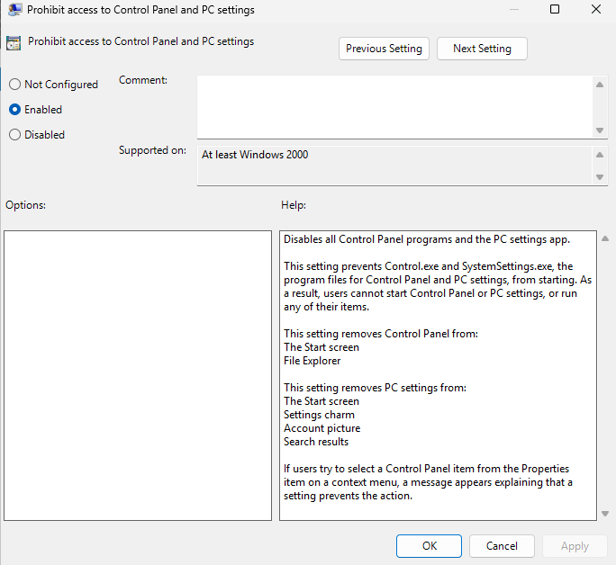

---

## 9. Simulated Help Desk Scenarios

To reinforce Active Directory administration skills, I completed several common help desk tasks.

### New Employee Onboarding

Created a new employee account, placed the user into the HR Organizational Unit, and assigned the appropriate security group.

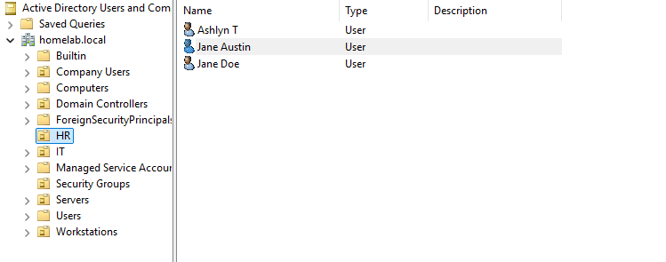

---

### Employee Offboarding

Disabled a former employee account and moved it into a Disabled Users Organizational Unit.

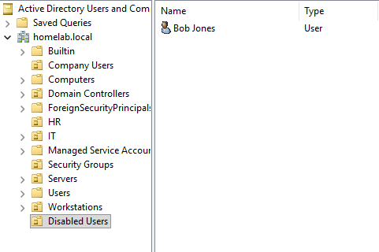

---

# What I Learned

Before this project, I had never deployed an Active Directory environment from scratch.

Building this lab helped me better understand how Domain Controllers, DNS, Organizational Units, security groups, and Group Policy work together inside a Windows Server environment.

I also became more comfortable performing common administrative tasks such as:

- Creating and managing user accounts
- Organizing users into departments
- Managing security groups
- Creating and linking Group Policy Objects
- Onboarding new employees
- Disabling user accounts
- Performing common Active Directory administration tasks

---

# Learning Resources

This project was completed using a combination of Microsoft's official documentation and community-created learning resources. These references helped reinforce concepts while building the lab and improving the documentation for this project.

## Microsoft Learn

- [Windows Server Documentation](https://learn.microsoft.com/windows-server/)
- [Active Directory Domain Services Overview](https://learn.microsoft.com/windows-server/identity/ad-ds/get-started/active-directory-domain-services-overview)

## Active Directory

- [Active Directory Home Lab Playlist](https://youtu.be/fbfSKgV2in8?si=hfXU7kx2C0gcxSO7)

## GitHub & Documentation

- [GitHub Portfolio Tutorial](https://youtu.be/z8UPAVTh2aE?si=U-vHv2dFYEV1Yp8p)
- [GitHub README Tutorial](https://youtu.be/zgqfWLHNKLk?si=wgqzEjhG6_o13NBN)
- [Markdown & GitHub README Guide](https://youtu.be/AU2I-GvQc0Q?si=cba-fo7aufMMFC1k)
- [GitHub README Tutorial (Additional)](https://youtu.be/gbBwIPs1NPw?si=GXLA4mZjFOluXmux)
- [GitHub Profile & Repository Tips](https://youtu.be/OShHVX_dBjo?si=_O0IbAha4nsfiRZ_)

