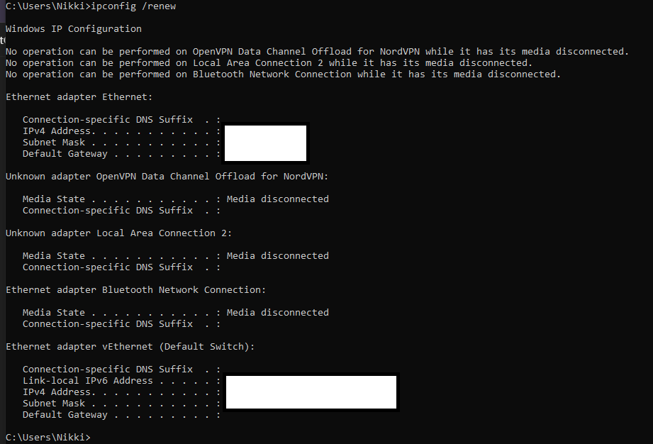
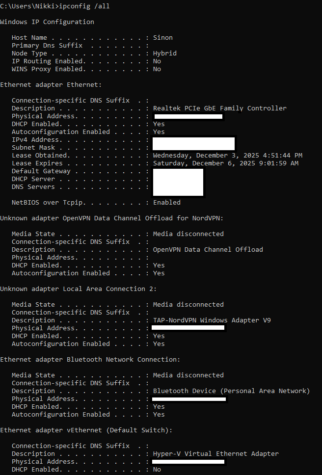
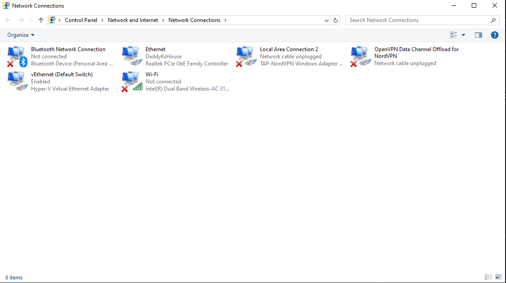
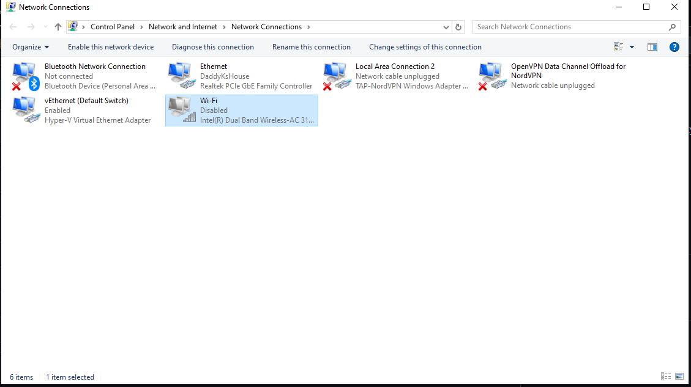
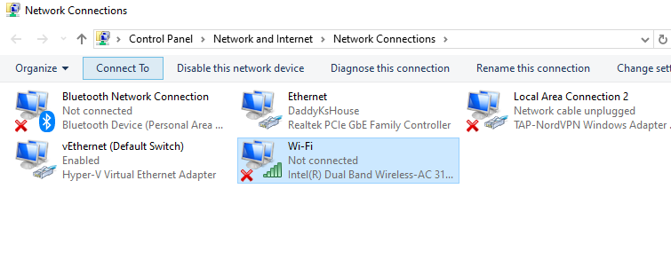
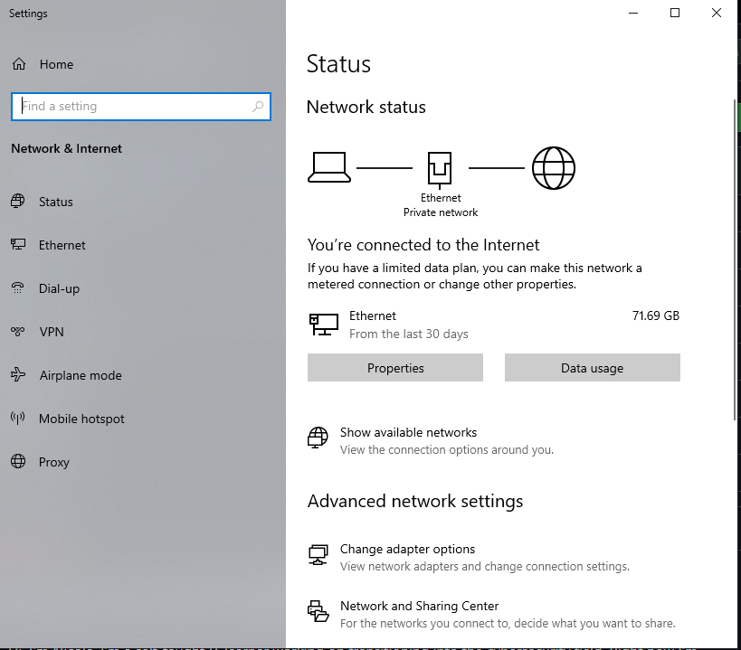

# Frost Network Troubleshooting Project

This project documents a basic network troubleshooting workflow on a Windows system.  
The goal was to check adapter status, confirm IP configuration, and verify whether the system was using Ethernet or Wi-Fi.

---

## 1. Checking Current IP Configuration

I started by running the following commands in PowerShell:

- ipconfig /renew
- ipconfig /all

These commands show the system’s active network adapters, assigned IP addresses, DNS settings, and whether DHCP is working.

### ipconfig /renew

### ipconfig /all

---

## 2. Verifying Adapter Status in Control Panel

Next, I checked the Network Connections window to see which adapters were active and which were disconnected.

### Network connections overview

---

## 3. Confirming Wi-Fi Status

The Wi-Fi adapter showed as disabled, which explains why the system was not showing available wireless networks.

### Wi-Fi disabled

### Wi-Fi adapter selected

---

## 4. Checking Network Status in Windows Settings

I also reviewed the general network status page to confirm the system was using Ethernet and had normal internet connectivity.

### Network status settings

---

## Summary

This project showed:

- The system was correctly using Ethernet.
- Wi-Fi was disabled at the adapter level.
- All IP information (DHCP, DNS, gateway) appeared normal.
- No faults were present with the active adapter.
- The disabled Wi-Fi adapter explains the lack of wireless network options.

