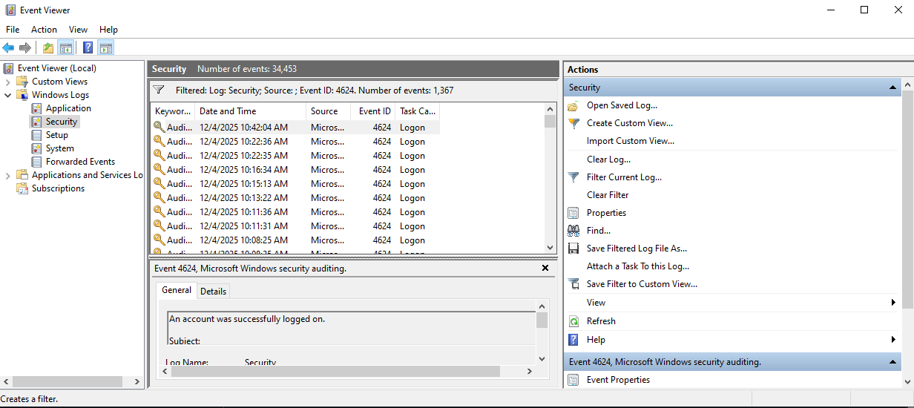
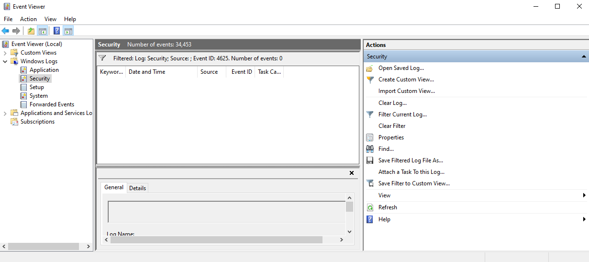
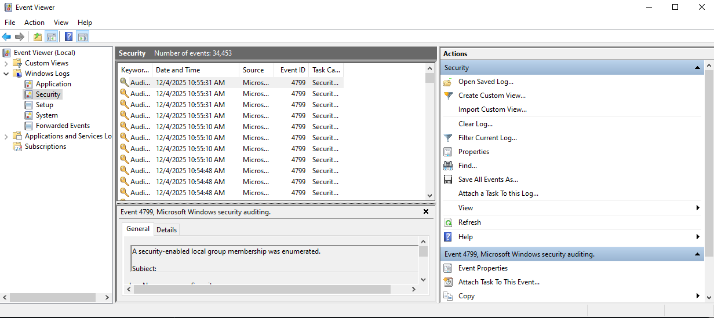
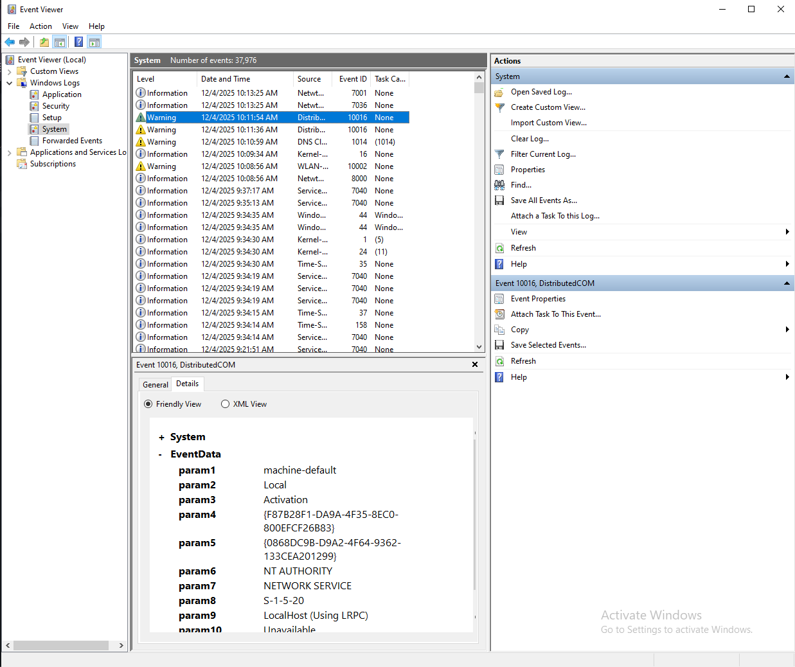

# Windows Event Log Investigation (Ice Project)

This project is me practicing how to look at Windows Event Logs and understand what they mean. I picked this because it’s simple, doesn’t need a VM, and helps me get more comfortable reading logs.

The main things I wanted to learn were:
- how to filter for specific event IDs
- how to read the details inside an event
- what normal activity looks like vs something suspicious
- how to navigate Event Viewer without being confused

---

## What I looked at

### 1. Successful Logon Event (Event ID 4624)
This event shows when an account logs in successfully. I filtered for 4624 in the Security log and looked at the details to see what a normal logon looks like.

---

### 2. Empty Filter Example
I tested a filter for an event ID that doesn’t exist on my system so I could see what an empty search looks like.

---

### 3. Local Group Enumeration (Event ID 4799)
This event shows when Windows checks or enumerates local group memberships. It’s not dangerous by itself, but attackers often do this during recon. I used it to practice reading long event details.

---

### 4. DistributedCOM Warning (Event ID 10016)
This warning appears on almost every Windows computer. It looks serious, but it’s usually harmless. I included it to show that not every warning means something is wrong.

---

## What I learned
- Event Viewer makes more sense once you know where to look.
- Most warnings are normal Windows noise.
- Filtering is so much easier than scrolling through thousands of logs.
- I’m starting to recognize common event IDs and what they mean.
- Even small projects like this help me build confidence with real security tools.

---

## Why this project is here
This is part of my cybersecurity learning portfolio. I’m teaching myself and doing hands-on practice with whatever I have available. Reading logs is a big part of security work, so this project helps me build that skill.

## Why this project is here
This is part of my cybersecurity learning portfolio. I’m teaching myself and doing hands-on practice with whatever I have available. Reading logs is a big part of security work, so this project helps me build that skill.

