# Linux VM Lab

## Objective

The goal of this lab was to build a foundation in Linux by creating an Ubuntu virtual machine in Oracle VirtualBox and becoming more comfortable using the Linux terminal.

During this lab I installed Ubuntu, practiced common Linux commands, learned how virtualization works, and documented what I learned.

## Environment

| Component | Details |
|-----------|---------|
| Host Operating System | Windows 11 Home |
| Hypervisor | Oracle VirtualBox 7.2.14 |
| Guest Operating System | Ubuntu Desktop 26.04 LTS |
| Memory | 6144 MB RAM |
| CPUs | 4 |
| Virtual Disk | 40 GB |

## Project Overview

This was my first Linux lab. I created an Ubuntu virtual machine and started getting comfortable using the terminal instead of clicking through everything with a mouse. Along the way I practiced common Linux commands, organized files, edited text files, checked system information, and learned how package updates work.

## Screenshots

### Setting Up the Virtual Machine

Installed Oracle VirtualBox and created the Ubuntu virtual machine.

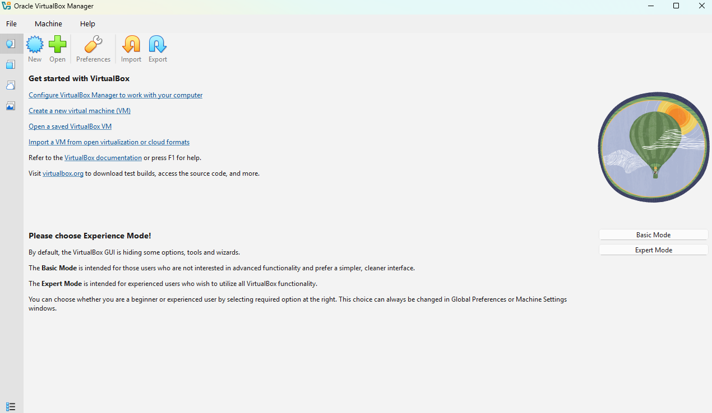

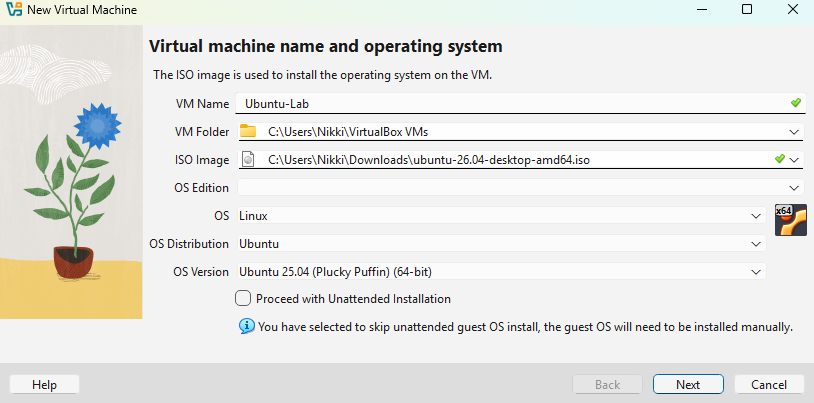

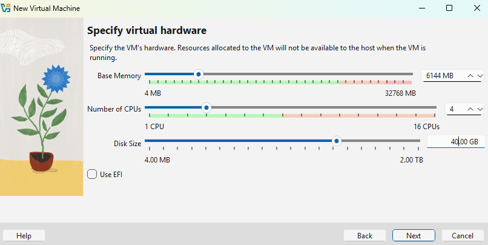

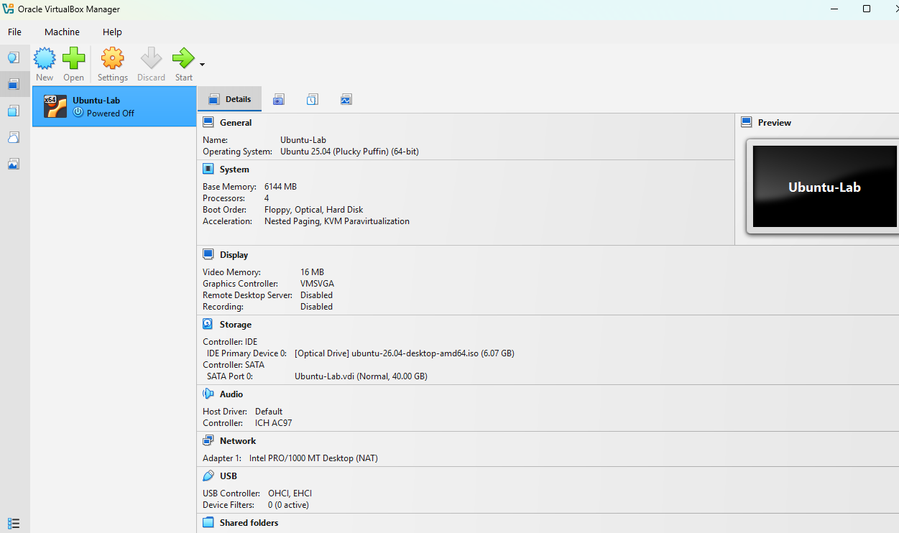

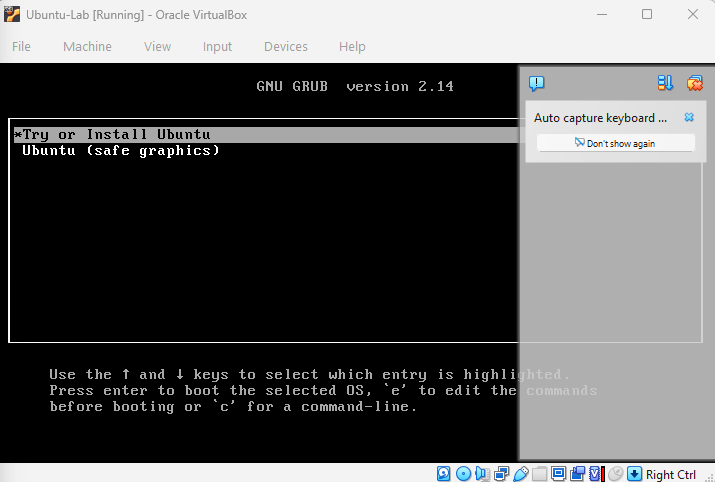

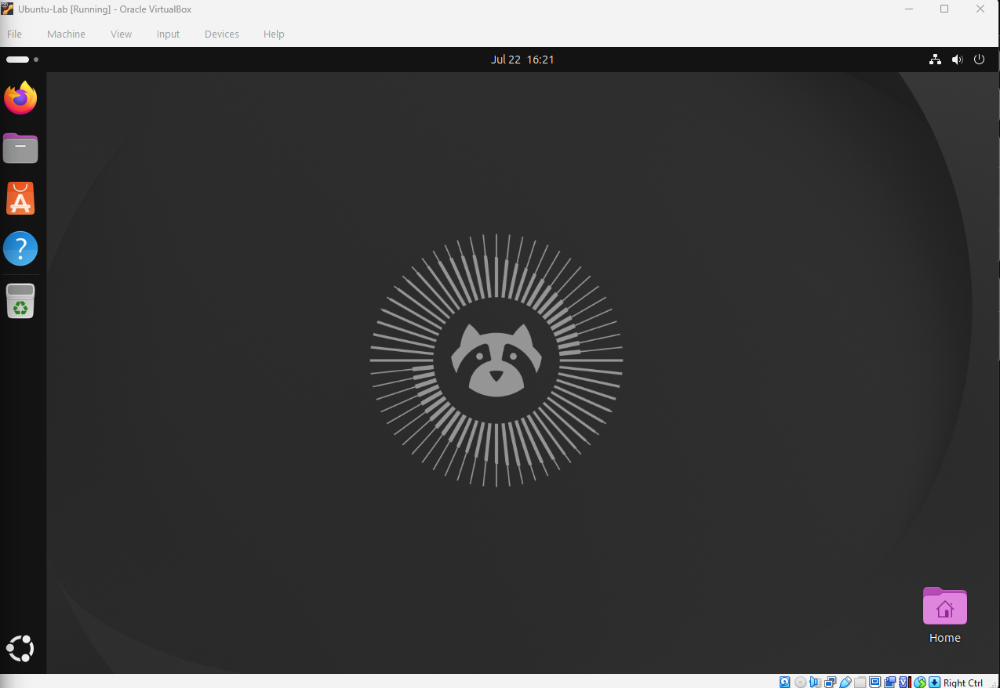

---

### Learning the Linux Terminal

Created folders, navigated directories, edited text files, and practiced common Linux commands.

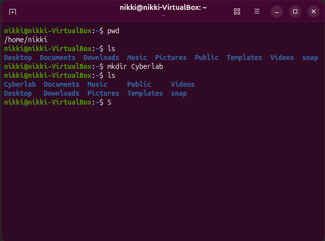

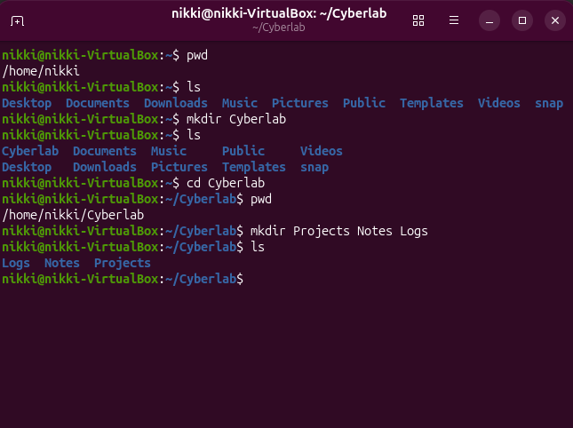

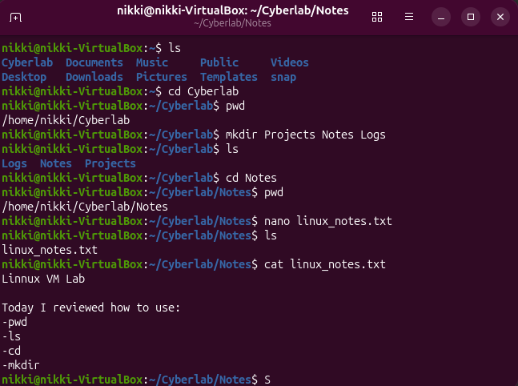

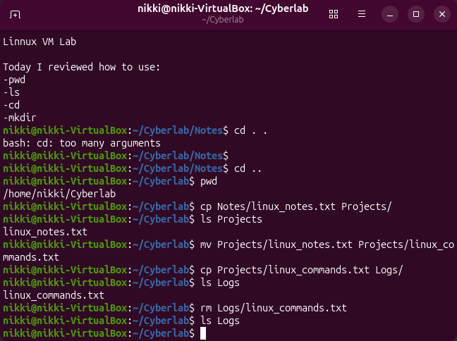

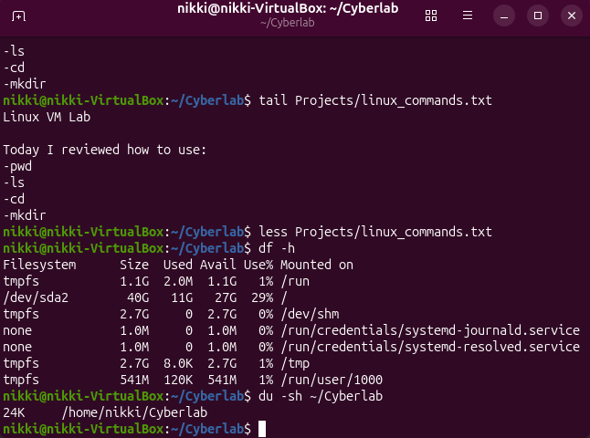

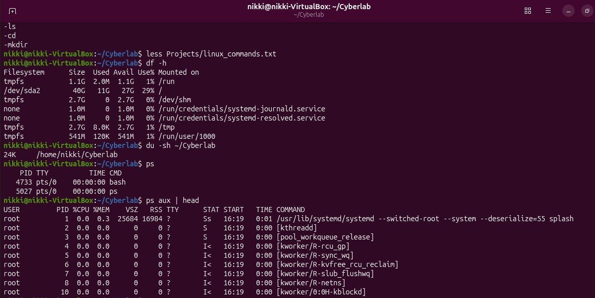

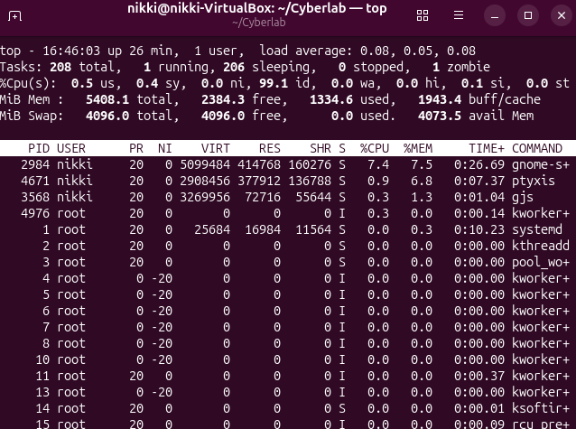

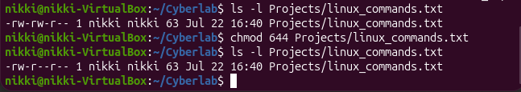

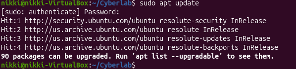

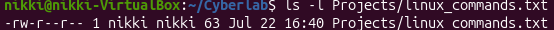

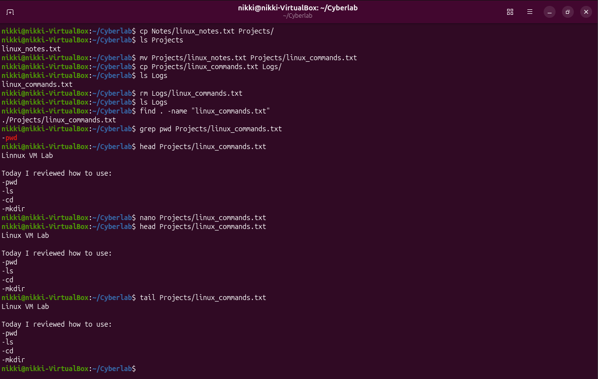

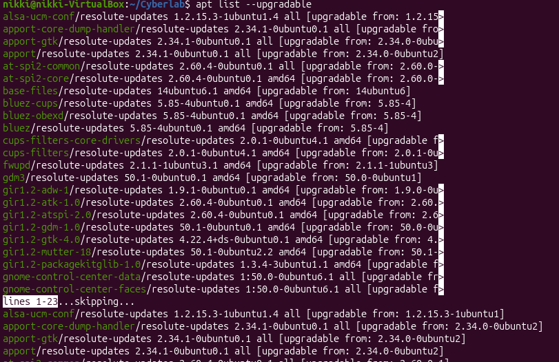

## Linux Commands Practiced

| Command | What I Used It For |
|---------|--------------------|
| `pwd` | Displayed my current working directory. |
| `ls` | Listed files and folders. |
| `cd` | Moved between directories. |
| `mkdir` | Created folders for organizing my lab files. |
| `nano` | Created and edited text files from the terminal. |
| `cat` | Displayed the contents of a text file. |
| `less` | Viewed a file one page at a time. |
| `head` | Displayed the first few lines of a file. |
| `tail` | Displayed the last few lines of a file. |
| `cp` | Copied files. |
| `mv` | Renamed and moved files. |
| `rm` | Deleted a file. |
| `find` | Searched for a file by name. |
| `grep` | Searched a file for specific text. |
| `df -h` | Checked disk usage. |
| `du -sh` | Checked the size of a directory. |
| `ps` | Viewed running processes. |
| `top` | Monitored running processes in real time. |
| `chmod` | Changed file permissions. |
| `sudo apt update` | Refreshed the package list from Ubuntu repositories. |
| `apt list --upgradable` | Viewed available package updates. |
| `ls -l` | Viewed file permissions and ownership. |

## What I Learned

## What I Learned

This lab helped me become much more comfortable using Linux from the terminal. Before this, I had some experience using Linux through TryHackMe, but this was my first time setting up my own Ubuntu virtual machine from start to finish. Going through the entire process myself made the commands feel much more natural and helped me better understand how Linux is used outside of guided labs.

I also learned how virtual machines work, how to organize files and folders from the command line, how to view and change file permissions, how to check running processes and disk usage, and how to check for package updates using `apt`. This gave me a much stronger understanding of Linux.

## Next Steps

## Next Steps

This lab gave me a good foundation, but I know there's still a lot to learn. My next goal is to keep practicing Linux until using the terminal feels natural. I also plan to learn more about users and groups, file permissions, package management, Bash scripting, and complete more Linux-focused labs on TryHackMe and Hack The Box while continuing to document my progress on GitHub.

