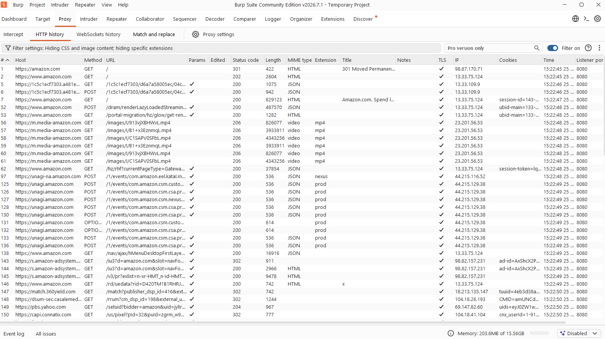

# Authentication

## Labs Completed

- [ ] Username enumeration via different responses

## Burp Suite Basics

Before starting the Authentication labs, I learned how to use Burp Suite's HTTP History tab to view the requests my browser sends to websites. I typed in Amazon.com

### Screenshot

