# Username Enumeration via Different Responses

## Objective

Use Burp Suite Intruder to find a valid username by comparing the server's responses, then find the correct password and complete the lab.

---

## Tools Used

- Burp Suite Community Edition
- Burp Intruder
- PortSwigger Web Security Academy

---

## Step 1 - Capture the Login Request

I opened the lab in Burp's browser and tried logging in with random credentials.

The login request appeared in HTTP History, so I sent it to Intruder.

I was still learning Burp at this point, so I spent some time looking through the request before moving on.

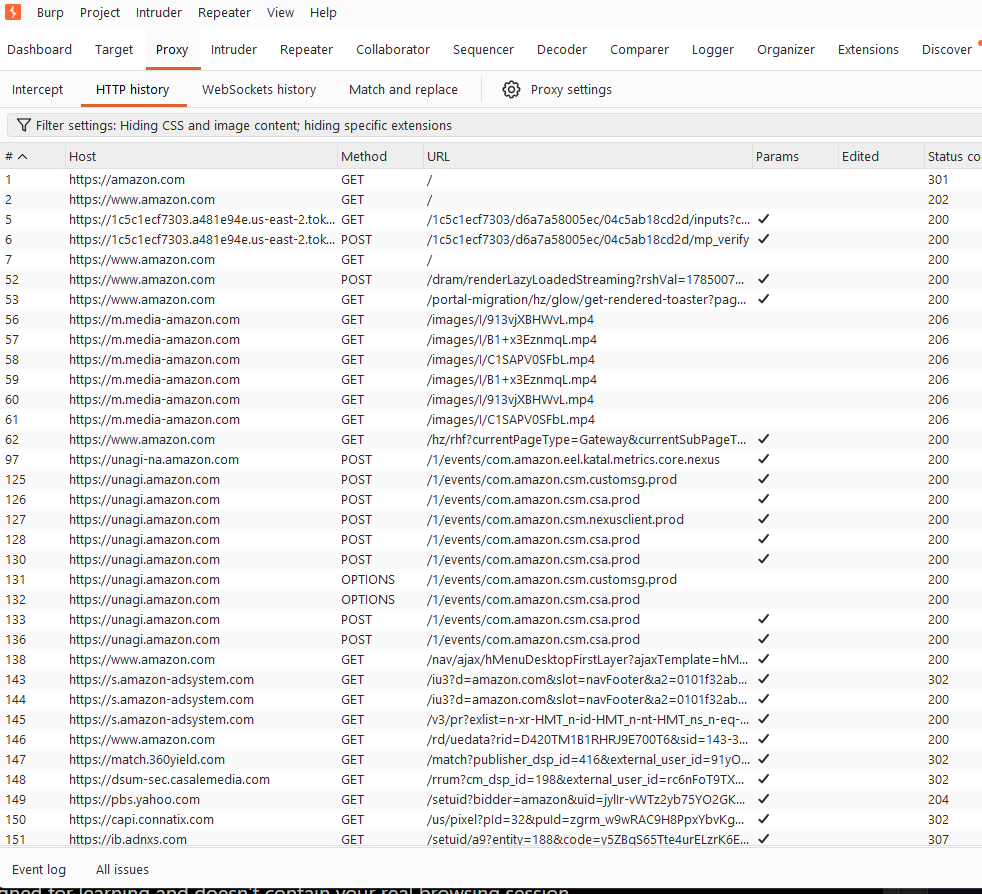

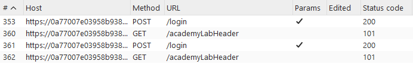

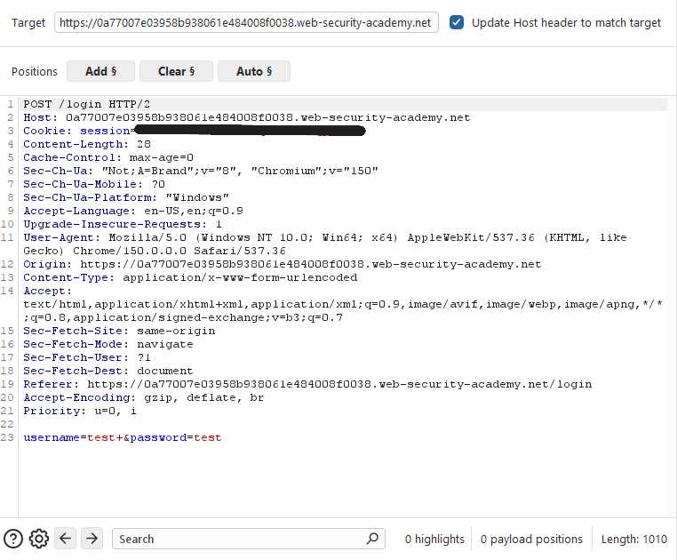

---

## Step 2 - Troubleshooting

My first Intruder attack didn't work.

I checked the proxy settings, Task Log, and Site Map to figure out what was wrong.

After some troubleshooting, I realized I needed to capture a new login request from the current lab session. Once I did that, everything worked correctly.

This ended up helping me understand Burp Suite a lot better.

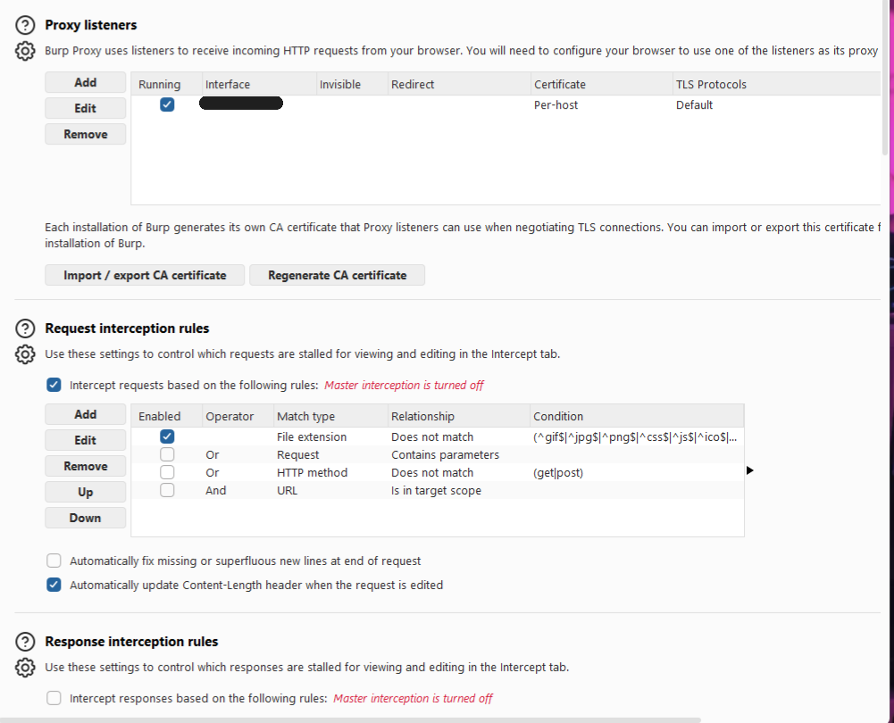

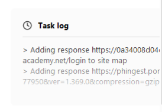

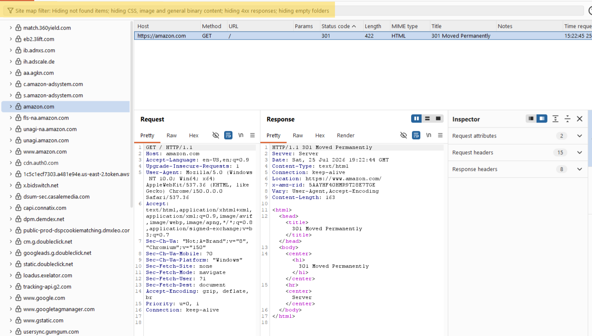

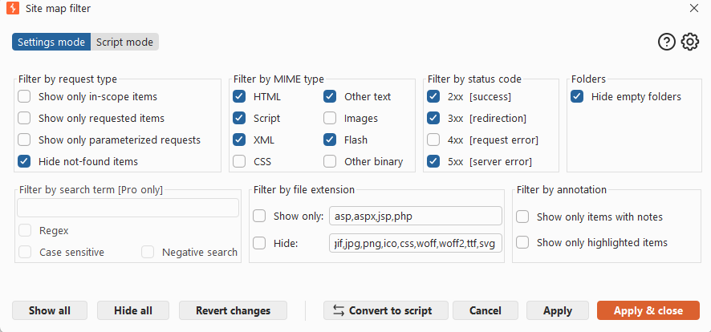

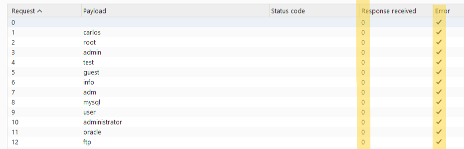

---

## Step 3 - Find the Username

I configured Intruder to test the usernames provided by the lab.

Instead of looking for a successful login, I compared the response lengths.

One username had a different response length than the rest.

The valid username was:

alterwind

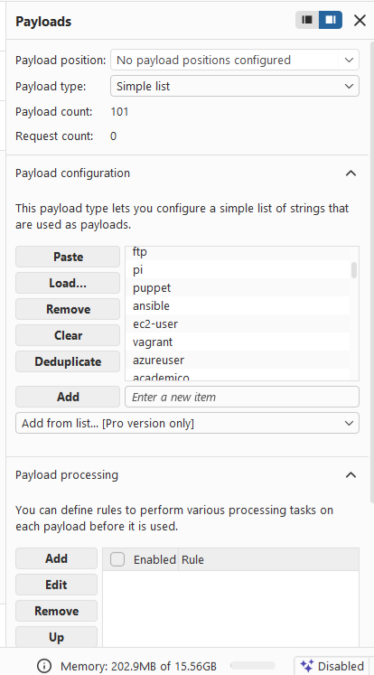

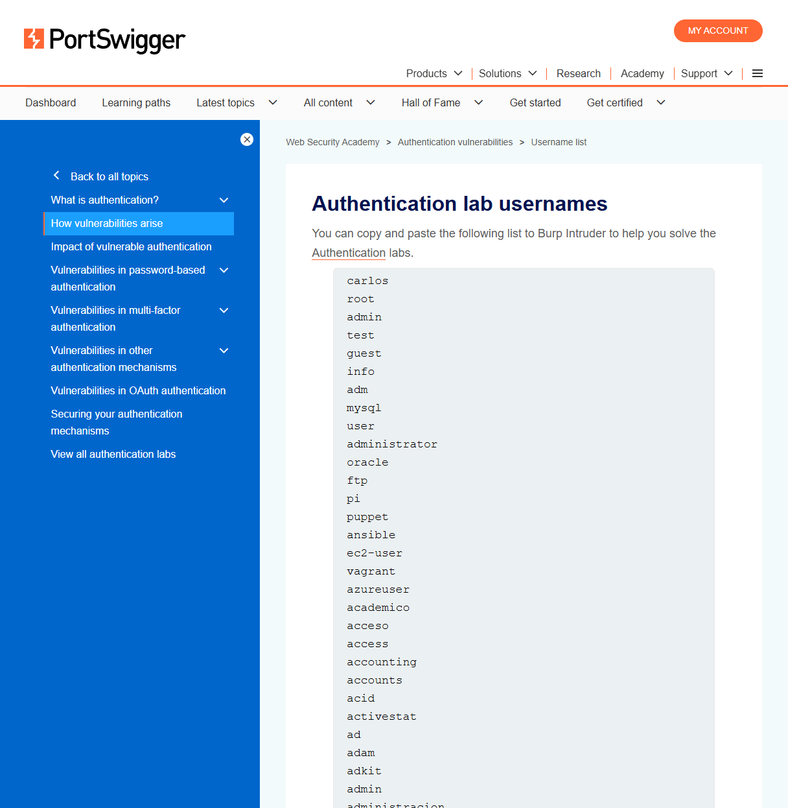

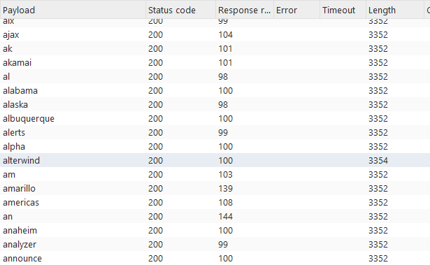

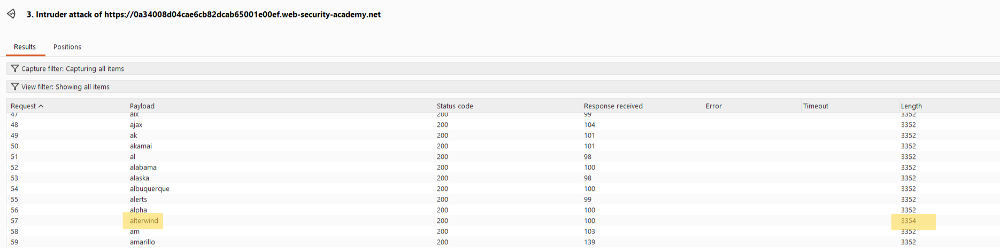

---

## Step 4 - Find the Password

After finding the username, I changed the payload position to the password field.

I loaded the password list and ran another Intruder attack.

This time I looked for a different status code. One response returned 302 instead of 200, showing the correct password.

The valid password was:

abc123

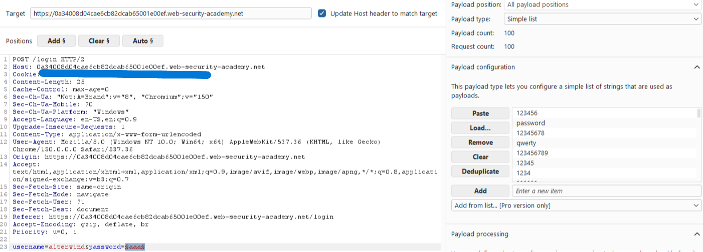

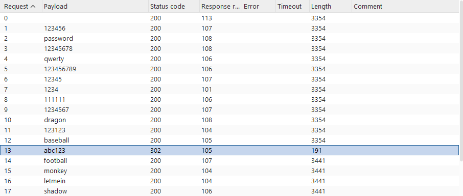

---

## Step 5 - Complete the Lab

I logged in with the username and password I found and completed the lab.

---

## What I Learned

- How to capture requests in Burp Suite
- How to send requests to Intruder
- How to configure payload positions
- How response lengths can identify a valid username
- How different status codes can identify a successful login
- Why it's important to capture a new request if a lab session changes
