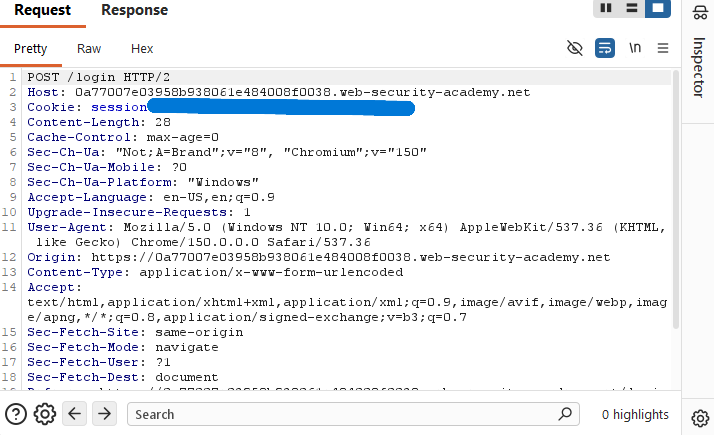

# Username Enumeration via Different Responses

## Objective

The goal of this lab was to identify a valid username by comparing small differences in the server's responses. Once I found the valid username, I used Burp Suite Intruder again to identify the correct password and complete the lab.

---

## Tools Used

- Burp Suite Community Edition
- Burp Intruder
- PortSwigger Web Security Academy

---

# Step 1 - Capturing the Login Request

I opened the PortSwigger lab in Burp's browser and submitted a login request using random credentials.

The request appeared in HTTP History, where I could inspect it before sending it to Intruder.

At this point I was mostly trying to get comfortable navigating Burp Suite and understanding how requests moved through the application.

---

# Step 2 - Troubleshooting

The first time I launched the Intruder attack, every request returned an error.

Instead of immediately starting over, I spent some time figuring out why.

I checked Burp's proxy settings, looked through the Task Log, explored the Site Map, and eventually realized Burp itself was working correctly.

The problem was that I was using a request from an expired lab session. After capturing a fresh login request, the attack worked normally.

Although it was frustrating at first, this ended up helping me understand Burp Suite much better.

---

# Step 3 - Username Enumeration

After fixing the session issue, I configured Intruder to test the usernames provided by the lab.

Instead of looking for a successful login, I compared the response lengths for each username.

One username returned a slightly different response than the others, indicating it was valid.

The valid username was:

**alterwind**

---

# Step 4 - Password Enumeration

Once I had the correct username, I replaced the username field with **alterwind** and moved the Intruder payload position to the password field.

I loaded the password list and launched another attack.

This time I looked for a different response status instead of response length.

One password returned a **302** response instead of **200**, indicating a successful login.

---

# Step 5 - Lab Completed

Using the discovered username and password, I successfully logged into the account and completed the PortSwigger lab.

---

# What I Learned

- How to capture login requests using Burp Suite.
- How to send requests to Burp Intruder.
- How response lengths can reveal a valid username.
- How response status codes can identify a successful login.
- How to troubleshoot Burp Suite when an attack isn't behaving as expected.
- The importance of capturing a fresh request after a lab session expires.
