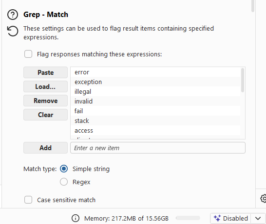
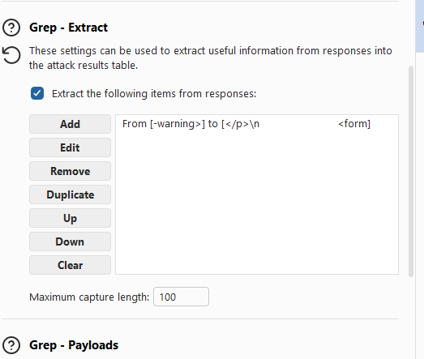
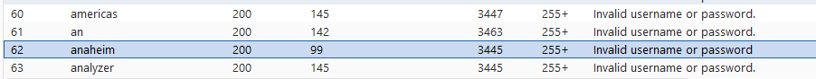
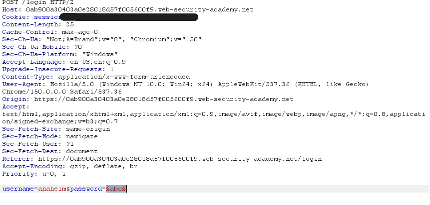
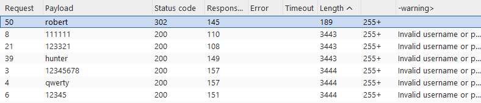

# Username Enumeration via Subtly Different Responses

## Objective

Find a valid username by comparing login responses, then use it to find the correct password and solve the lab.

---

## Tools Used

- Burp Suite Community Edition
- Burp Intruder
- PortSwigger Web Security Academy
- [PortSwigger Youtube]([https://portswigger.net/web-security/authentication/password-based/lab-username-enumeration-via-subtly-different-responses](https://youtu.be/ouDe5sJ_uC8?si=Y-NozewmaqAFwL40))

---

## Steps Taken

1. Captured the `POST /login` request in Burp Suite.
2. Sent the request to Intruder.
3. Used Sniper with the username as the payload.
4. Loaded the candidate usernames wordlist.
5. Sorted the results by response length, but nothing stood out.
6. Used Grep Match and Grep Extract to compare the responses.
7. Found that the username `anaheim` had a different response because it was missing the period at the end of the error message. Instead of "Invalid username or password." it was "Invalid username or password" with no period. It was the only difference I could find.
8. Changed the payload to the password and kept the username set to `anaheim`.
9. Loaded the candidate passwords wordlist and ran the attack again.
10. Found that the password `robert` had a `302` status code.
11. Logged in with:
    ```
    Username: anaheim
    Password: robert
    ```
12. Solved the lab.

---

## What I Learned

- Small response differences can reveal valid usernames.
- Grep Extract makes small differences easier to spot.
- Burp Intruder makes username and password enumeration much faster.

---

## Screenshots

### Grep Match



Configured Grep Match while checking the responses.

---

### Grep Extract



Configured Grep Extract to compare the login messages.

---

### Valid Username



Found the valid username `anaheim` after noticing the missing period.

---

### Password Attack



Configured the password attack using the valid username.

---

### Valid Password



Found the correct password `robert` after seeing the `302` response.

---

### Lab Complete


Successfully logged in and completed the lab.
